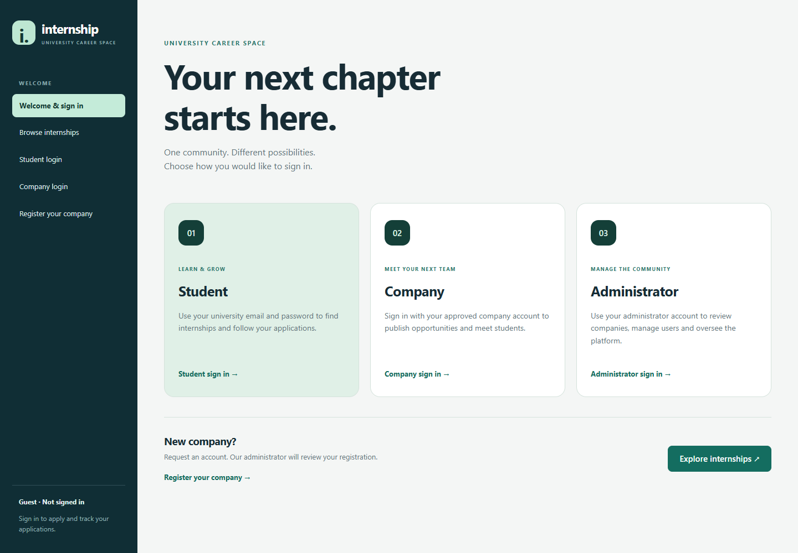
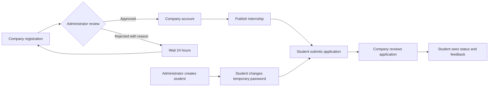
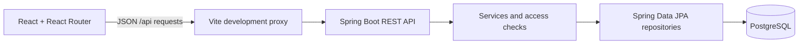

<div align="center">

# Internship Management

### From a first opportunity to a first professional experience.

A university internship platform connecting **students**, **companies** and **administrators**.


[Features](#features) · [Quick start](#quick-start) · [API](#api-reference) · [Testing](#testing) · [Roadmap](#roadmap)

</div>



## Overview

This project manages the complete internship application journey: a company requests access, an administrator approves it, the company publishes an internship, and a student applies and receives a decision.

The core workflow is implemented and has been checked against a local PostgreSQL database. Some administration and profile features are still in progress; see the [roadmap](#roadmap). This repository is an educational MVP, not a production deployment package.

## Features

| Role | Available in the interface |
| --- | --- |
| **Guest** | Browse active internships, view details, submit a company registration and check its status through a private link. |
| **Student** | Sign in with an issued account, change a temporary password, search internships, submit a motivation letter and track personal applications and company feedback. |
| **Company** | Sign in after approval; publish, edit, close and reopen its internships; review incoming applications and save decisions and comments. |
| **Administrator** | Create student accounts, issue/reset temporary passwords, review company details and approve or reject registrations. |

The sidebar displays the signed-in user's name, email and role. Each role has its own navigation; ownership is also checked by the backend.

### The application journey



### Important business rules

- Students do not register publicly. Administrators issue accounts with a faculty number, specialty and course **1–4**.
- Student logins follow `s<facultyNumber>@students.example`. These are demo university identifiers, not real mailboxes. There is no Microsoft Teams/SSO connection.
- A temporary password must be changed before protected student operations are available. Resetting or changing a password invalidates older tokens.
- Company accounts are created only after approval. A rejection requires a reason; another request using the same representative/contact email is allowed after 24 hours.
- Registration decisions are checked through a saved private link. Email notifications and lost-link recovery are not implemented.
- A student can apply only once to an internship. It must be `ACTIVE`, and its deadline must not have passed.
- Closing an internship preserves existing applications. Editing a closed offer does not reopen it; reopening is a separate action.
- Disabled users are rejected on subsequent authenticated requests, including requests using previously issued tokens.

## Architecture



| Layer | Technology |
| --- | --- |
| Frontend | React 19, React Router 7, Vite 8, CSS |
| Backend | Java 17 target, Spring Boot 3.5, Spring Web, Spring Security |
| Persistence | Spring Data JPA / Hibernate, PostgreSQL |
| Authentication | Signed JWTs, BCrypt password hashes, database-backed role/account checks |
| API documentation | springdoc OpenAPI / Swagger UI |
| Checks | JUnit 5, Mockito, Oxlint, Vite build |
| Local database option | Docker Compose with PostgreSQL 16 |

React and Spring Boot run as separate development processes. Vite forwards `/api` requests to `http://127.0.0.1:8080`. The frontend build is not automatically packaged into the Spring Boot JAR.

## Quick start

The commands below use **PowerShell** and run from the repository root unless noted. On macOS/Linux, use `./mvnw` instead of `.\mvnw.cmd` and the equivalent shell syntax.

### 1. Prerequisites and checkout

| Requirement | Version / notes |
| --- | --- |
| JDK | 17 or later, with `JAVA_HOME` pointing to the JDK. Local checks used Corretto 18. |
| Node.js | Vite requires `^20.19.0` or `>=22.12.0`. Node 22.12+ is a suitable choice. |
| npm | Included with Node.js. Use the committed lockfile through `npm ci`. |
| PostgreSQL | Docker setup uses 16; local development was checked with 18.4. |
| Docker | Optional; needed only for the container-based database setup. |
| Maven | The repository includes Maven Wrapper; a separate installation is not required. |

The integrated application is available on `main`:

```powershell
git clone --branch main https://github.com/Bobozavr/sit-internship-management-team-69.git
cd sit-internship-management-team-69
```

For an existing checkout, use your existing folder. Do not overwrite local configuration or uncommitted work.

### 2. Choose one database setup

<details>
<summary><strong>Option A — PostgreSQL in Docker</strong></summary>

Create a local `.env` file beside `docker-compose.yml`:

```dotenv
POSTGRES_DB=internship_management
POSTGRES_USER=internship_app
POSTGRES_PASSWORD=replace_with_your_local_password
POSTGRES_PORT=5432
```

Replace the example password, then start the database:

```powershell
docker compose up -d postgres
docker compose ps
```

If an installed PostgreSQL already occupies port 5432, use `POSTGRES_PORT=5433` and the same port in the Spring datasource URL. The named volume retains database data. Changing `.env` values does not change credentials in an already initialized volume.

Docker Compose starts **only PostgreSQL**, not the backend or frontend. The `.env` file is ignored by Git and is read by Compose; Spring Boot does not automatically load it.

</details>

<details>
<summary><strong>Option B — Installed PostgreSQL</strong></summary>

Start the PostgreSQL service. Create an application role and database using PostgreSQL tools or pgAdmin. For example, with the tools available on `PATH`:

```powershell
createuser -U postgres --pwprompt internship_app
createdb -U postgres --owner=internship_app internship_management
```

Enter the requested passwords interactively. If `psql`, `createuser` or `createdb` is not found, use the executables in your PostgreSQL installation's `bin` folder, or create the role/database through pgAdmin.

For an existing project database, keep its configured name and credentials; do not recreate it.

</details>

### 3. Configure Spring Boot

For a new checkout, copy the example configuration:

```powershell
Copy-Item src/main/resources/application-example.properties src/main/resources/application.properties
```

Skip the copy if your local file already exists. Edit its datasource values to match the chosen database:

```properties
spring.datasource.url=jdbc:postgresql://localhost:5432/internship_management
spring.datasource.username=internship_app
spring.datasource.password=your_local_database_password
```

The JWT signing secret is required. For a newly copied example file, this PowerShell snippet generates a random secret and replaces its `${JWT_SECRET}` placeholder in the ignored local configuration without printing the secret:

```powershell
$jwtBytes = New-Object byte[] 48
$jwtRandom = [System.Security.Cryptography.RandomNumberGenerator]::Create()
$jwtRandom.GetBytes($jwtBytes)
$jwtRandom.Dispose()
$localConfig = (Resolve-Path 'src/main/resources/application.properties').Path
$localText = [IO.File]::ReadAllText($localConfig)
$localText = $localText.Replace('${JWT_SECRET}', [Convert]::ToBase64String($jwtBytes))
[IO.File]::WriteAllText($localConfig, $localText)
```

Alternatively, leave the placeholder and provide `JWT_SECRET` in the backend process environment. Use at least 32 characters and keep the same private key between restarts if existing sessions should remain valid.

| Setting | Purpose |
| --- | --- |
| `spring.datasource.*` | Database connection |
| `app.jwt.secret` / `JWT_SECRET` | Private signing key |
| `app.jwt.expiration-ms` / `JWT_EXPIRATION_MS` | Token lifetime; example default is 24 hours |
| `app.admin.email` / `ADMIN_EMAIL` | Initial administrator email |
| `app.admin.password` / `ADMIN_PASSWORD` | Initial administrator password |
| `server.port` | Backend port; default 8080 |

**Local educational administrator:** `admin@example.com` / `admin12345`. These defaults are in the backend initializer and can be overridden. The initializer creates the account only if its email does not exist; changing these settings does not reset an existing account's password. Replace the defaults for any shared deployment.

Never commit `application.properties`, `.env`, signing keys or real credentials. The local configuration files are covered by `.gitignore`.

### 4. Initialize or upgrade the schema

The SQL files in `database/migrations` are **manual incremental migrations**, not a complete database bootstrap and not automatically run by Flyway/Liquibase.

**Empty database:** the example configuration uses `spring.jpa.hibernate.ddl-auto=update`. Start the backend once to create the entity tables, wait for the successful startup message, then stop it with `Ctrl+C`:

```powershell
.\mvnw.cmd spring-boot:run
```

**Existing database:** stop the backend before applying the migrations. Do not run a schema drop or recreate operation.

Apply both migrations in order. For installed PostgreSQL:

```powershell
psql -h localhost -p 5432 -U internship_app -d internship_management -W -v ON_ERROR_STOP=1 -f database/migrations/20260920_student_credentials.sql
psql -h localhost -p 5432 -U internship_app -d internship_management -W -v ON_ERROR_STOP=1 -f database/migrations/20260920_company_status.sql
```

Use your own database user/port if different. For Docker, run the equivalent commands inside the database service:

```powershell
Get-Content -Raw database/migrations/20260920_student_credentials.sql | docker compose exec -T postgres sh -c 'psql -U "$POSTGRES_USER" -d "$POSTGRES_DB" -v ON_ERROR_STOP=1'
Get-Content -Raw database/migrations/20260920_company_status.sql | docker compose exec -T postgres sh -c 'psql -U "$POSTGRES_USER" -d "$POSTGRES_DB" -v ON_ERROR_STOP=1'
```

The migrations preserve existing rows and can be rerun. They add password-change/token-version fields and private registration-status token hashes plus uniqueness indexes. If an index fails because an older database contains duplicate pending requests, inspect those records before resolving the conflict.

After initialization/migration, set the local configuration to:

```properties
spring.jpa.hibernate.ddl-auto=validate
```

### 5. Start the application

Backend terminal, from the repository root:

```powershell
.\mvnw.cmd spring-boot:run
```

Frontend terminal:

```powershell
cd frontend
npm ci
npm run dev -- --host 127.0.0.1 --port 5173 --strictPort
```

| Service | Local address |
| --- | --- |
| Application | http://127.0.0.1:5173/ |
| Backend | http://127.0.0.1:8080/ |
| Swagger UI | http://127.0.0.1:8080/swagger-ui/index.html |
| OpenAPI JSON | http://127.0.0.1:8080/v3/api-docs |

A backend root page is not provided; use the React application or Swagger. Keep both terminals running. Stop each process with `Ctrl+C` when finished. `docker compose stop postgres` stops the container without removing its data volume.

## First demonstration

No sample students, companies or internships are automatically inserted. An empty catalog is expected until an approved company publishes an offer.

1. **Administrator:** sign in and create a student. Save the issued email and temporary password.
2. **Student:** sign in, choose a new password and sign out.
3. **Guest/company representative:** submit a company registration and save its private status link.
4. **Administrator:** open **Company registrations**, review the details and approve the request.
5. **Company:** open the status link, refresh it and sign in with the registration credentials. Publish an internship from **Our offers & applications**.
6. **Student:** find that internship and submit a motivation letter.
7. **Company:** review the application, save a status and write feedback.
8. **Student:** open or refresh **My applications** to see the decision.

The current account session is stored in `sessionStorage`. Use separate browser sessions or sign out between roles during a demo. Status changes appear when the relevant page is loaded/refreshed; real-time notifications are not implemented.

## Status reference

| Entity | States | Meaning |
| --- | --- | --- |
| Company registration | `PENDING`, `APPROVED`, `REJECTED` | Awaiting administrator review, accepted, or declined with a reason. |
| Internship | `ACTIVE`, `CLOSED`, `INACTIVE` | Accepting applications before deadline, closed by company, or administratively disabled. Admin moderation controls remain on the roadmap. |
| Student application | `PENDING`, `UNDER_REVIEW`, `APPROVED`, `REJECTED` | Submitted, being reviewed, accepted, or declined. Companies cannot set an application back to `PENDING`. |
| Work style | `ONSITE`, `REMOTE`, `HYBRID` | Location/attendance format. |

## API reference

Use `Authorization: Bearer <token>` for protected endpoints. Role and ownership checks are enforced by Spring Security and services. Swagger/OpenAPI describes request/response fields.

| Area | Method and path | Access |
| --- | --- | --- |
| Account login | `POST /api/auth/login` | Administrator / approved company credentials |
| Student login | `POST /api/auth/university-login` | Issued student credentials |
| Current account | `GET /api/auth/me` | Authenticated account |
| Change password | `POST /api/auth/password` | Authenticated account, including temporary-password sessions |
| Register company | `POST /api/company-registration-requests` | Public |
| Registration status | `GET /api/company-registration-requests/status` | Private token in `X-Registration-Token` |
| Review registrations | `GET /api/admin/company-registration-requests`, `GET …/pending`, `GET …/{id}` | Administrator |
| Decide registration | `PATCH /api/admin/company-registration-requests/{id}/approve` or `/reject` | Administrator |
| Create student | `POST /api/admin/student-accounts` | Administrator |
| Reset student password | `POST /api/admin/student-accounts/{id}/reset-password` | Administrator |
| Browse internships | `GET /api/offers`, `GET /api/offers/{id}` | Public |
| Company's internships | `GET`, `POST /api/company/offers` | Company |
| Edit internship | `PUT /api/company/offers/{id}` | Owning company |
| Close / reopen | `PATCH /api/company/offers/{id}/close` or `/reopen` | Owning company |
| My applications | `GET`, `POST /api/student/applications`; `GET …/{id}` | Student; personal records only |
| Incoming applications | `GET /api/company/applications`; `GET /api/company/offers/{offerId}/applications` | Owning company |
| Review application | `PATCH /api/company/applications/{applicationId}/status` | Owning company |
| Profiles | `GET`, `PUT /api/student/profile` or `/api/company/profile` | Matching role; frontend editors pending |
| Admin listings | `GET /api/admin/users`, `/companies`, `/students`, `/offers`, `/applications` | Administrator; some UI controls pending |
| Enable / disable user | `PATCH /api/admin/users/{id}/enabled` | Administrator; UI pending |
| Basic statistics | `GET /api/admin/stats` | Administrator; expanded metrics/UI pending |

`GET /api/offers` supports `location`, `type` and `skill` filters. The frontend also searches the loaded catalog by keyword; a server-side general keyword filter remains to be added. Offer deletion is not implemented; companies close offers instead.

Registration links use a random token in the URL fragment. The database stores its hash. The status response includes the company name, decision, feedback and dates, not contact emails or password hashes. Anyone holding the link can see that limited information. The earlier numeric public status endpoint is no longer used.

## Repository structure

```text
internship-management/
├── frontend/
│   ├── src/api/                # REST requests and data-loading helpers
│   ├── src/components/         # Forms, role-aware navigation, cards
│   ├── src/pages/              # Student, company, admin and public pages
│   └── vite.config.js          # Local /api proxy
├── src/main/java/.../
│   ├── controller/             # REST endpoints
│   ├── service/                # Business rules and ownership checks
│   ├── repository/             # Database access
│   ├── entity/                 # JPA entities and enums
│   ├── dto/                    # API contracts and validation
│   ├── mapper/                 # Entity → DTO mapping
│   ├── security/               # JWT and access configuration
│   └── config/                 # Initial administrator
├── src/main/resources/
│   └── application-example.properties
├── src/test/java/              # Unit tests and application context test
├── database/migrations/        # Manual incremental SQL migrations
├── docs/                       # Workflow guides and screenshots
├── docker-compose.yml         # Optional PostgreSQL container
└── pom.xml                     # Backend dependencies and build
```

The main database entities are users, student profiles, companies, company registration requests, internship offers and applications. Each application connects one student profile to one internship offer. Password hashes remain server-side.

## Testing

Run the focused backend unit suite without a running database:

```powershell
.\mvnw.cmd "-Dtest=AuthSecurityTest,CompanyRegistrationServiceTest,CompanyOffersTest" test
```

The current suite contains **19 tests** covering credentials, blocking, password changes, token invalidation, course validation, registration/retry rules, status-token handling, offer ownership and lifecycle rules.

Run all backend tests only after configuring the local database and JWT secret:

```powershell
.\mvnw.cmd test
```

The application-context test starts Spring Boot and uses the configured database; use a development/test database. The focused suite passed during local verification; this is not a claim of a passing CI pipeline or an automated end-to-end test suite in the repository.

Frontend checks:

```powershell
cd frontend
npm run lint
npm run build
```

Browser/API checks performed during development included registration → approval → company login, mandatory student password change, publication → application → decision, closing/reopening, and attempts to access another student's/company's data. The temporary verification records were removed.

To build a backend JAR without running tests:

```powershell
.\mvnw.cmd -DskipTests package
java -jar target/internship-management-0.0.1-SNAPSHOT.jar
```

This is a build/start command, not a substitute for testing. The frontend still needs its own server. Vite's configured development proxy does not provide a production hosting setup or an API proxy for `vite preview`.

## Troubleshooting

| Symptom | Check |
| --- | --- |
| Backend cannot connect to PostgreSQL | Database service/container, datasource URL, port, user and password. Docker on 5433 requires a matching JDBC URL. |
| JWT secret missing | Configure `app.jwt.secret` locally or export `JWT_SECRET` in the backend process environment. |
| Schema validation fails | Initialize an empty schema first, then apply both SQL migrations. Do not drop existing data to fix a missing column. |
| Maven/Java startup fails | Check `java -version` and `JAVA_HOME`. The wrapper needs network access on first use. |
| Frontend cannot reach the API | Keep backend on port 8080 and use the documented frontend address on 5173. Check `frontend/vite.config.js` if changing ports. |
| Port 5173 is occupied | Stop the previous frontend process or deliberately update the development port and backend CORS configuration. |
| Admin password override has no effect | Initializer settings create missing accounts; they do not reset existing passwords. |
| Student is sent to password change | Expected for newly issued/reset accounts. Complete the change before accessing the workspace. |
| Company cannot sign in | Registration must be approved. Use the representative/sign-in email, not necessarily the contact email. |
| No internships or applications appear | No sample data is seeded. Publish an active, non-expired offer and apply using a student account. |
| Registration cannot be resubmitted | Check for an existing pending/approved request or the 24-hour rejection cooldown. |
| Old token stops working | Sign in again after password reset/change, token expiry or signing-key changes. A disabled account requires administrator action. |

## Roadmap

| Item | Current state |
| --- | --- |
| Core student/company application journey | Implemented and checked locally |
| Role-aware navigation and personal records | Implemented |
| Student provisioning and temporary passwords | Implemented |
| Company registration, private status and admin review | Implemented |
| Company offer management and application decisions | Implemented |
| User blocking controls in administrator UI | Backend endpoint exists; UI pending |
| Administrator internship moderation | Company-side restrictions exist; admin action/UI pending |
| Expanded statistics | Basic counts exist; approved applications, popular skills and dashboard pending |
| Student/company profile editing | Backend endpoints exist; frontend forms pending |
| Server-side keyword search | Frontend keyword search exists; backend enhancement pending |
| Clean-machine setup validation | Instructions provided; independent fresh-machine verification pending |
| Final specification audit, diagrams and presentation | Pending final delivery review |
| CI, production deployment and real university SSO | Not configured in this MVP |

## More documentation

- [Student accounts and temporary passwords](docs/student-accounts.md)
- [Company registration and review](docs/company-registration.md)
- [Company offers and application review](docs/company-workspace.md)

## Team and contribution workflow

Developed as a team university project, with frontend and backend contributions integrated in this repository. See the [commit history](https://github.com/Bobozavr/sit-internship-management-team-69/commits/main) for recorded contributions.

Use feature branches, keep local credentials out of commits, run the relevant checks and describe database migrations in pull requests. Final contributor names, individual responsibilities and submission materials should match the team's actual work and course requirements.
